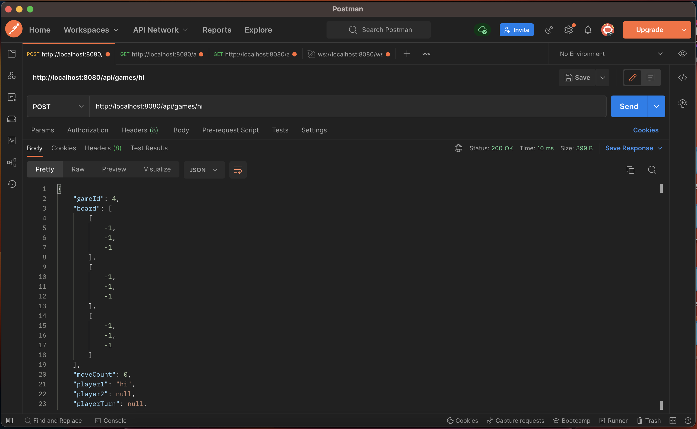

# Fullstack Tic-Tac-Toe

## Overview

A Tic-tac-toe application that allows 2 players to play against each other.

Built using ReactJS, Spring Boot, and Postgres.

- [Design consideraations](#design-considerations)
  - [Accessibility considerations](#accessibility-considerations)
  - [Architecture considerations](#architecture-considerations)
- [Architecture Implementation](#architecture-implementation)
- [Getting started](#getting-started)
  - [Prerequisites](#prerequisites)
  - [Installation](#installation)
  - [Usage](#usage)
  - [API functions](#api-functions)
  - [App demonstration](#app-demonstration)

### Design considerations

#### Accessibility considerations

With accessibility in mind, the frontend was designed with Chakra UI. It provides a range of inclusive components that enable users to interact with, using only a keyboard.
The frontend is also responsive, allowing users to play the game even with different orientations.
ARIA landmarks have been implemented to help users to skip over unnecessary information.

Furthermore, colors used throughout the application have a contrast ratio of at least 3:1 against adjacent components.
For example, when a button has the focus, it displays a #F00000 outline which has a contrast ratio of 3.04: 1 against the #2E2E2E background.

The game requires users to click on the submit button to enter their input. This is to prevent users from inputting the wrong choice while using the screen reader to read the grid.
In the case of an error, users will be provided with both text displaying the error and audio cues to help those who may have difficulty understanding visual cues.
<br /><br />

#### Architecture considerations

To simplify installation, the application has been containerized using Docker. Which allows for easy installation of the application in different environments.

To allow multiplayer gameplay, Websocket has been implemented to inform clients to update their game to its latest state.
<br /><br />

#### Assumptions

In a game, player names are used as identifiers and each player has a unique name within that game. However, it is possible for different games to have players with the same name, as player names are not globally unique.

### Architecture Implementation


Three components are used to design the application, namely: database, backend, and frontend.
Firstly, Postgres database is used to store all games played by users and is deployed on port 5432.

Secondly, Spring Boot - backend, sends Hibernate sql queries to port 5432 to interact with the database.
Similarly, it is deployed on port 8080 and exposes 2 endpoint, API and websocket.
API allows the frontend to fetch data while Websocket informs subscribers that an update has occurred.
Upon receiving an update, the frontend will send a GET request to fetch the latest game data.

Lastly, upon starting the frontend - ReactJS, it will attempt to connect to the backend through the Websocket port and start listening for websocket events.
If the event received is related to the player's current game, the player browser will send an API request to the backend, and render components based on the data fetched.
Players can access the website on localhost port 3000.

## Getting started

### Prerequisites

- Docker

  > [Installation guide](https://docs.docker.com/get-docker/)

- Port 3000, 5432, and 8080 to be available

### Installation

1. Clone this repository

```
git clone https://gitfront.io/r/user-7911234/utZTDuQjoXoo/AET-swe_AngHaoJun.git
or
git clone https://github.com/zerotoxicity/gTechAT.git
```

### Usage

1. Build and deploy Docker containers

```
docker compose up --build
```

2. Launch two browsers and go to the following url:

```
http://localhost:3000
```

3. On browser 1, enter Player name and select the "New Game" button.

4. On browser 2, enter Player name and the game ID, then select the "Join Game" button.

### API functions

- Retrieve all games

```
GET http://localhost:8080/api/games
```


<br /><br />

- Retrieve game based on game ID

```
GET http://localhost:8080/api/games/{game ID}
```

Retrieve game 1 - `GET http://localhost:8080/api/games/1`


<br /><br />

- Create new game

```
POST http://localhost:8080/api/games/{player 1 name}
```

Player **hi** creates a new game - `POST http://localhost:8080/api/games/hi`


<br /><br />

- Connect Player 2 to a game

```
PUT http://localhost:8080/api/games/{game ID}/{player 2 name}
```

Player **bye** joins game 4 - `PUT http://localhost:8080/api/games/4/bye`

<br /><br />

- Make a move

```
PUT http://localhost:8080/api/games/{game ID}/{player name}
```

Player **hi** makes a move in game 4 - `PUT http://localhost:8080/api/games/4`


### App demonstration

[](https://user-images.githubusercontent.com/31730313/223983933-2927b5b2-f564-44c3-bf57-94a3f990eb0e.mp4)

Previous video shows player **Keyboard** uses only keyboard to interact with app, while player **Mouse** interacts using a mouse.

<br /> <br /> <br />

[](https://user-images.githubusercontent.com/31730313/223982260-b4361794-60c5-4721-9ba0-7983159122a2.mp4)

The previous video shows the interaction of the application with a screen reader
<br /> <br /> <br /> <br />


<br />
Screenshot of the application in portrait mode
<br /> <br /> <br /> <br />


Screenshot of the application in landscape mode
